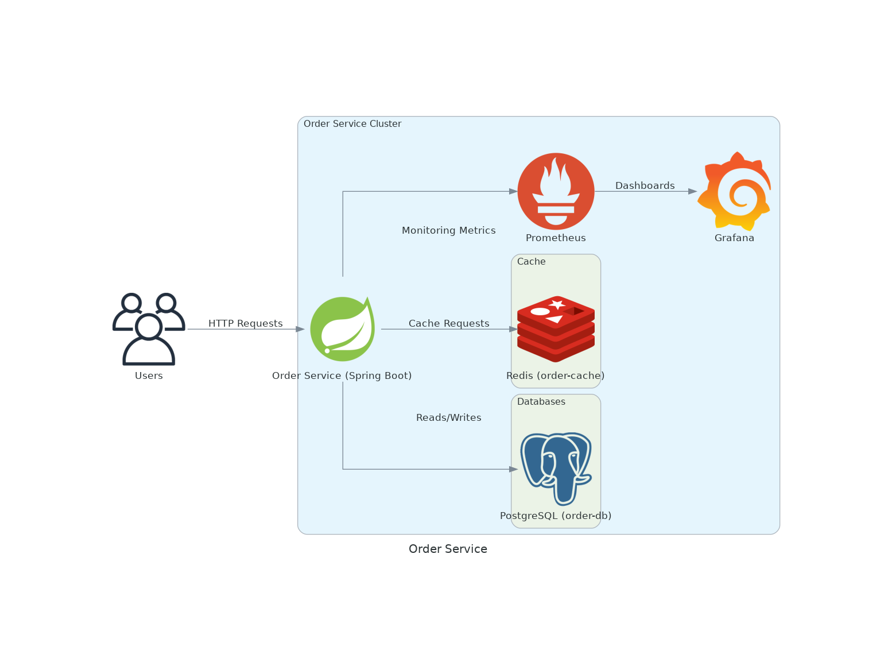

# **Order API**

## **Descrição**

A **Order API** é uma aplicação **Spring Boot** que gerencia pedidos e oferece endpoints RESTful para operações **CRUD**. A aplicação utiliza uma arquitetura moderna com suporte a **cache, persistência, monitoramento e observabilidade** via Prometheus e Grafana.  

A infraestrutura pode ser iniciada facilmente via **Makefile**, utilizando **Docker Compose** para os ambientes **staging** e **produção**, enquanto no ambiente **local** a aplicação deve ser iniciada manualmente.

---

## **Endpoints Disponíveis**

### **Base URL**: `/orders`

#### **1. Obter todos os pedidos**
- **Método**: `GET`
- **Descrição**: Retorna uma lista de pedidos cadastrados.
- **Resposta**:
  - `200 OK`: Lista de pedidos (JSON).
  - `400, 404, 500`: Detalhes de erro.

#### **2. Processar um pedido**
- **Método**: `POST`
- **Descrição**: Cria um novo pedido.
- **Body**: JSON representando o pedido.
- **Resposta**:
  - `200 OK`: Pedido processado com sucesso (JSON).
  - `400, 404, 500`: Detalhes de erro.

#### **3. Obter um pedido por ID externo**
- **Método**: `GET /{externalId}`
- **Descrição**: Retorna os detalhes de um pedido específico pelo `externalId`.
- **Resposta**:
  - `200 OK`: Dados do pedido (JSON).
  - `400, 404, 500`: Detalhes de erro.

---

## **Tecnologias Utilizadas**
- **Java 21**: Linguagem de programação principal.
- **Spring Boot 3.4.2**: Framework para construção de aplicações robustas.
- **PostgreSQL**: Banco de dados relacional.
- **Redis**: Armazenamento em cache.
- **Docker & Docker Compose**: Containerização de serviços.
- **Prometheus & Grafana**: Monitoramento e visualização de métricas.
- **SpringDoc OpenAPI**: Documentação da API REST.
- **Hibernate Validator**: Validação de entrada.
- **Micrometer com Prometheus**: Métricas de monitoramento.
- **MapStruct**: Mapeamento de objetos.

---

## **Como Executar a Aplicação**

### **Pré-requisitos**
- **JDK 21** instalado para desenvolvimento local.
- **Docker & Docker Compose** instalados.

### **1️⃣ Ambiente Local (Desenvolvimento)**
A aplicação precisa ser iniciada **manualmente** na IDE ou pelo JAR, enquanto os serviços auxiliares (Banco, Redis, etc.) são iniciados via Docker Compose.

#### **Subindo os serviços auxiliares**
```bash
make up_local
```

#### **Rodando a aplicação**
1. **Na IDE**: Rode a classe principal `OrderApiApplication.java`.  
2. **Via terminal (caso já tenha o JAR gerado)**:
   ```bash
   java -jar build/libs/order-api.jar
   ```

#### **Acessando a aplicação**
- API: [http://localhost:8082/order-service/swagger-ui/index.html](http://localhost:8082/order-service/swagger-ui/index.html)  
- Banco de Dados (PostgreSQL): `localhost:5432`  
- Cache Redis: `localhost:6379`

#### **Derrubando os serviços auxiliares**
```bash
make down_local
```

---

### **2️⃣ Ambiente Staging**
#### **Subindo os serviços**
```bash
make up_stg
```
#### **Acessando a aplicação**
- API: [http://localhost:8080/order-service/swagger-ui/index.html](http://localhost:8082/order-service/swagger-ui/index.html)  
- Banco de Dados (PostgreSQL): `localhost:5432`  
- Cache Redis: `localhost:6379`

#### **Derrubando os serviços**
```bash
make down_stg
```
#### **Derrubando os serviços e volumes**
```bash
make downv_stg
```
#### **Reiniciando os serviços**
```bash
make restart_stg
```

---

### **3️⃣ Ambiente Produção**
#### **Subindo os serviços**
```bash
make up_prod
```
#### **Acessando a aplicação**
- API: [http://localhost:8080/order-service/swagger-ui/index.html](http://localhost:8082/order-service/swagger-ui/index.html)  
- Banco de Dados (PostgreSQL): `localhost:5432`  
- Cache Redis: `localhost:6379`

#### **Derrubando os serviços**
```bash
make down_prod
```
#### **Derrubando os serviços e volumes**
```bash
make downv_prod
```
#### **Reiniciando os serviços**
```bash
make restart_prod
```

---

## **Monitoramento e Observabilidade**
- **Prometheus**: `http://localhost:9090`
- **Grafana**: `http://localhost:3000` (usuário: `admin`, senha: `admin123`)

---

## **Estrutura do Projeto**

### **Camadas Principais**
- **Controller**: Define os endpoints da API.
- **Service**: Contém a lógica de negócios.
- **Repository**: Acesso ao banco de dados.

---

## **Docker Compose**
A aplicação utiliza **Docker Compose** para gerenciar os ambientes **Staging** e **Produção**.  
O ambiente **Local** depende da execução manual da aplicação.

### **Serviços Definidos**
- `order-service`: Serviço principal da API.
- `order-db`: Banco de dados PostgreSQL.
- `order-cache`: Cache Redis.
- `prometheus`: Coletor de métricas.
- `grafana`: Visualizador de métricas.

---

## **📌 Observação**
Para garantir que os **pré-requisitos** estão atendidos antes de subir os serviços, o `Makefile` já possui verificações automáticas para:
- Docker instalado ✅
- Docker Compose instalado ✅
- JDK 21 instalado ✅

Caso algum pré-requisito não seja atendido, o `Makefile` informará o erro antes de continuar.  

---

